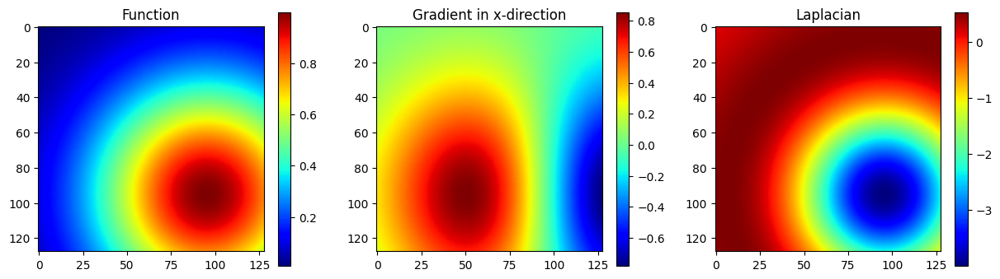
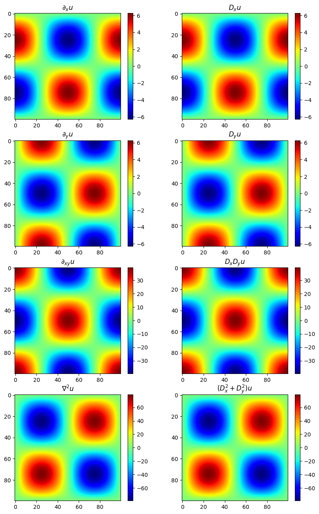

# FDX

**A high-order finite-difference library for Python**, designed to scale from NumPy to distributed HPC systems.

> **Status:** Work in progress. Only 1D and 2D operators are currently implemented and verified. The library is well-suited for small-scale problems, testing, and educational use.


---

## Features

- Build structured 1D and 2D grids associated with different finite-difference schemes
- Supports custom boundary conditions (Dirichlet, periodic, ghost-points)
- Matrix-based finite-difference operators are implicitly defined and can be applied to scalar and vector fields — similar to automatic differentiation libraries
- Multiple finite-difference schemes: compact, explicit, and implicit (tridiagonal)

---

## Grid Types

### `Grid1d`

```python
grid = domain.Grid1d(a, b, n, bc, scheme, verbose)
```

| Parameter | Type | Description |
|-----------|------|-------------|
| `a` | `float` | Left boundary of the domain |
| `b` | `float` | Right boundary of the domain |
| `n` | `int` | Number of grid points |
| `bc` | `BoundaryCondition` | `DIRICHLET`, `PERIODIC`, or `GHOST_POINTS` |
| `scheme` | `FiniteDifferenceScheme` | `COMPACT`, `EXPLICIT`, or `IMPLICIT` (tridiagonal) |
| `verbose` | `bool` | Print sparse matrix coefficients |

### `Grid2d`

```python
grid = domain.Grid2d(xa, xb, nx, ya, yb, ny, bcx, bcy, scheme, verbose)
```

| Parameter | Type | Description |
|-----------|------|-------------|
| `xa`, `xb` | `float` | Left and right boundaries in x |
| `nx` | `int` | Number of grid points in x |
| `ya`, `yb` | `float` | Left and right boundaries in y |
| `ny` | `int` | Number of grid points in y |
| `bcx`, `bcy` | `BoundaryCondition` | Boundary conditions in x and y |
| `scheme` | `FiniteDifferenceScheme` | `COMPACT`, `EXPLICIT`, or `IMPLICIT` (tridiagonal) |
| `verbose` | `bool` | Print sparse matrix coefficients |

---

## Example Usage

```python
import numpy as np
from matplotlib import pyplot as plt
from fdx import finite_differences_grid as Ω

# Create a 2D grid
grid = Ω.Grid2d(
    xa=-1., xb=1., nx=128, bcx=Ω.BoundaryCondition.DIRICHLET,
    ya=-1., yb=1., ny=128, bcy=Ω.BoundaryCondition.DIRICHLET,
    scheme=Ω.FiniteDifferenceScheme.COMPACT, verbose=False,
)

X, Y = np.meshgrid(grid.x, grid.y)
u = 1.0 * np.exp(-(X - 0.5)**2 - (Y - 0.5)**2)

Du        = grid.Grad(u)
Laplacian = grid.Laplacian(u)

plt.figure(figsize=(16, 4))
plt.subplot(1, 3, 1); plt.imshow(u,     cmap='viridis'); plt.colorbar(); plt.title('Function')
plt.subplot(1, 3, 2); plt.imshow(Du[0], cmap='viridis'); plt.colorbar(); plt.title('Gradient (x)')
plt.subplot(1, 3, 3); plt.imshow(Laplacian, cmap='viridis'); plt.colorbar(); plt.title('Laplacian')
plt.show()
```



---

## Installation

### User Installation

This library is not yet available on PyPI. Install directly from GitHub using [uv](https://docs.astral.sh/uv/):

```bash
uv add git+https://github.com/wme7/fdx.git
```

### Developer Installation

Clone the repository and navigate to the project folder:

```bash
git clone https://github.com/wme7/fdx.git
cd fdx
```

Install all dependencies including development and optional extras:

```bash
uv sync --all-extras
```

---

## Development

### Running Tests

```bash
uv run pytest
```

### Test Coverage

```bash
# Coverage summary
uv run pytest --cov=fdx

# HTML coverage report
uv run pytest --cov=fdx --cov-report=html
```

### Linting and Formatting

```bash
uv run ruff check --fix
uv run ruff format
```

### Type Checking

```bash
uv run ty check
```

---

## Verification Scripts

A set of scripts in the `scripts/` directory verifies the physical implementation integrity of the finite-difference operators:

```bash
uv run scripts/use_example.py
uv run scripts/use_fdx1d_derivative.py
uv run scripts/use_fdx2d_derivatives.py
uv run scripts/viz_animation.py
```

For example, `use_fdx2d_derivatives.py` produces:



See the [`scripts/`](./scripts) directory for details on all available verification scripts.

Addtionally, we provide some example `jupyter` notebooks in the [`notebooks/`](./notebooks) folder to introduce finite-difference methods implementation in 1-d, and their usage through 2-d examples of vector fields.

---

Happy coding!